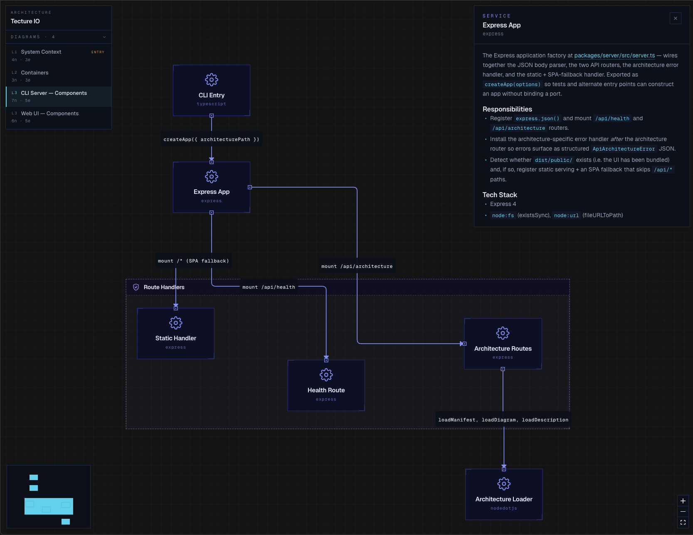

# Tecture

**A drillable, plain-text model of any software system — authored by coding agents.**

[](https://www.npmjs.com/package/@tecture/core)
[](./LICENSE)

Tecture stores software architecture as JSON + Markdown in `./architecture/`, structured top-down so you can drill through it in your browser. Use it to brief an agent before it touches a codebase, document the system you have, sketch the one you want, or onboard a teammate.

Any agent that reads [SKILL.md](https://agentskills.io) can author and update the model the same way it edits source code; you review the result like any other PR. Cloned a repo that already has `./architecture/`? Run `npx @tecture/core` and start drilling.

The format follows the [C4 model](https://c4model.com) (system → container → component) without the DSL. Runs locally — no account, no SaaS.



## Quickstart

```bash
# 1. Install the skill (one-time)
npx skills add tecture-io/tecture-skill

# 2. In your project, ask your agent:
#    > Document this codebase architecture using tecture

# 3. Render it
npx @tecture/core
# → http://localhost:3000
```

## What the agent writes

```
architecture/
├── manifest.json              # project name + list of diagrams
├── diagrams/
│   ├── system-context.json    # one diagram per zoom level
│   └── containers.json
└── descriptions/
    └── api-server.md          # one Markdown page per node
```

A diagram is a graph of nodes (`service`, `datastore`, `external`, `person`, …) and edges (`calls`, `reads`, `writes`, `publishes`, …):

```json
{
  "nodes": [
    { "id": "api", "type": "service",   "label": "API Server" },
    { "id": "db",  "type": "datastore", "label": "Postgres"   }
  ],
  "edges": [
    { "from": "api", "to": "db", "type": "reads" }
  ]
}
```

No DSL to learn, any LLM can write it natively, and every change shows up in `git diff` next to the code that caused it.

This repo documents itself — see [`./architecture`](./architecture) for a complete worked example.

## Links

- [tecture-io/tecture-skill](https://github.com/tecture-io/tecture-skill) — the SKILL.md your agent reads
- [`@tecture/core`](https://www.npmjs.com/package/@tecture/core) — the viewer
- [Contributing](./CONTRIBUTING.md) · [MIT License](./LICENSE)