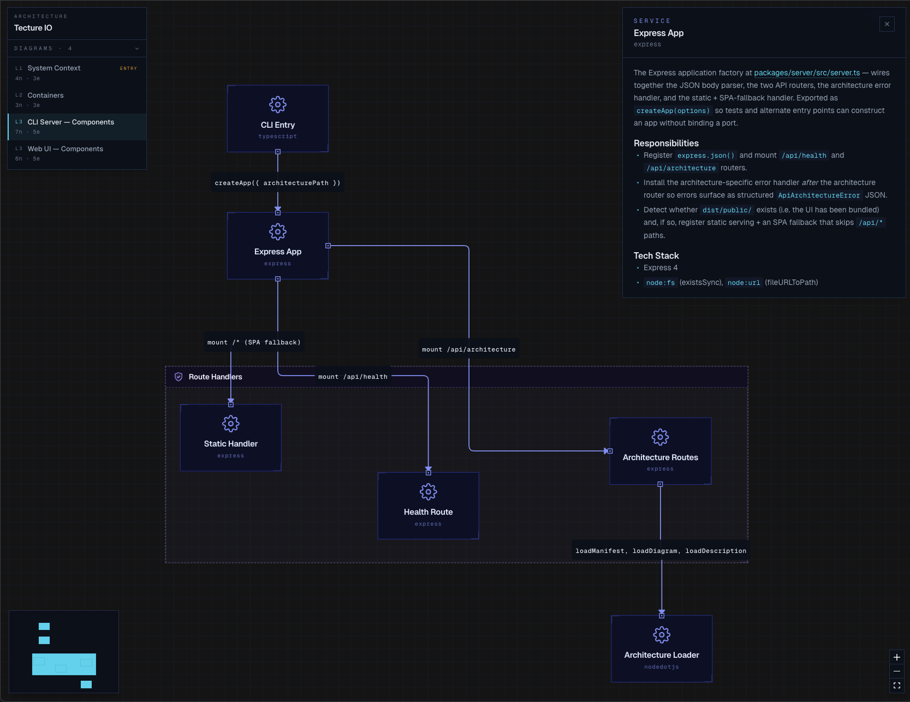
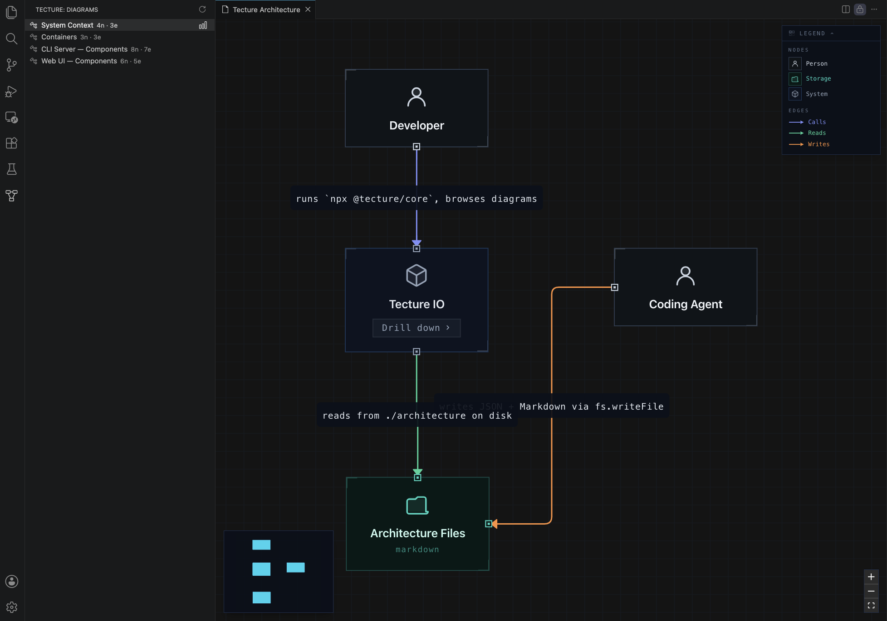

# Tecture

**Architecture documentation, generated and maintained by your coding agent.**

[](https://www.npmjs.com/package/@tecture/core)
[](./LICENSE)
[](https://discord.gg/pHbmuBkbcp)

Tecture is an architecture documentation format — structured JSON and Markdown — designed for AI coding agents to write and maintain. Install a skill into your coding agent, ask it to map a repo, and get a multi-level architecture map you can navigate visually: system context → containers → components → the files that implement them.

The output is a folder of plain files that lives in the repo alongside the code. As the codebase changes, the agent updates the map the same way it ships any other change — you review the diff like any other PR.



## Quickstart

**1. Install the architecture-docs skill** (works with Claude Code, Cursor, Copilot, Aider, and other major coding agents)

```bash
npx skills add tecture-io/architecture-docs
```

**2. Generate the map.** From your project root, invoke the skill:

- **Claude Code** — run `/architecture-docs`
- **Cursor, Copilot, Aider, and other agents** — ask in plain language, e.g. *"Document this codebase's architecture"* or *"Map this repo with the architecture-docs skill."*

The agent reads the code and writes the architecture into an `architecture/` folder. Expect a few minutes on a medium repo.

**3. Visualize it.**

**VS Code** — install the [Tecture extension](https://marketplace.visualstudio.com/items?itemName=Tecture.tecture-vscode) (also on [Open VSX](https://open-vsx.org/extension/tecture/tecture-vscode) for Cursor, Windsurf, and VSCodium). Open the command palette and run **Tecture: Open Architecture**, or use the Tecture sidebar. The extension activates automatically when it detects an `architecture/` folder.



**Browser** — if you don't use VS Code, run the standalone viewer:

```bash
npx @tecture/core
# → http://localhost:3000
```

Drill into containers and components to see what's inside. Click any node to read its Markdown description — embedded Mermaid diagrams included — for the context the code itself doesn't tell you.

## What gets generated

```
architecture/
├── manifest.json               # top-level diagram + list of diagrams
├── diagrams/
│   ├── system-context.json     # nodes + edges for one diagram
│   └── containers.json
└── descriptions/
    └── api-server.md           # Markdown description for one node
```

Each diagram is one level of a multi-level architecture view (system → containers → components). Nodes represent systems, services, datastores, and similar building blocks; edges are relationships like `calls`, `reads`, or `publishes`. See [`./architecture`](./architecture) for a worked example — this repo documents itself.

## How it's different

- **Not a diagram DSL.** Mermaid, PlantUML, and Structurizr expect a human to author and maintain the diagram. Tecture is authored by your coding agent and kept current by the same agent.
- **Not a one-shot wiki.** Tools like DeepWiki produce a snapshot that drifts the moment the code moves. Tecture's output is files in your repo — refineable, version-controlled, regenerable.
- **Not a code-search tool.** Sourcegraph, Cody, and Greptile answer questions about individual files. Tecture produces a structured, navigable map of the whole system — the layer above per-file search.

## Vision

Tecture's goal is to make software architecture legible. Architecture knowledge today tends to live in people's heads, in stale documents, or nowhere at all. We think it should be a maintained, navigable artifact that lives with the code.

Today, Tecture relies entirely on AI coding agents to generate and update architecture maps — and agents are getting remarkably good at this. The human's role is to review and refine what the agent produces, the same way you'd review any other PR. Over time we plan to introduce structural analysis (parsing dependency graphs, module boundaries, call patterns) to complement what the agent sees, producing more accurate maps with less manual correction.

## Roadmap

- **Sharper skills.** Specialized skills tuned for specific tech stacks and common reference architectures.
- **Structural analysis.** Static analysis to supplement agent-generated maps with verified dependency and call-graph data.

A hosted, multi-repo edition for organisations with many services is in design separately.

## Contributing

Contributions welcome. See [CONTRIBUTING.md](./CONTRIBUTING.md) for the dev loop, repo layout, and scripts.

## License

[MIT](./LICENSE) © Tecture.io
