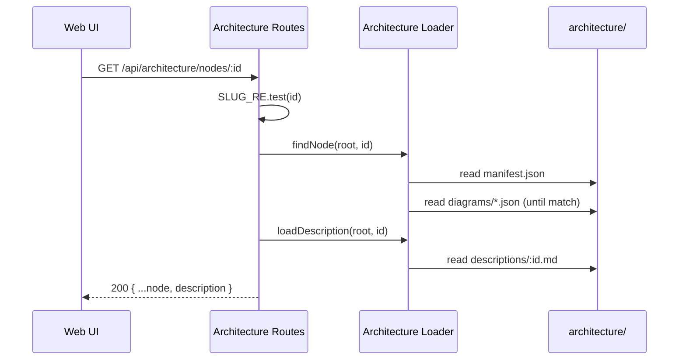

The REST surface over the architecture filesystem, defined in [packages/server/src/routes/architecture.ts](packages/server/src/routes/architecture.ts). Seven read-only endpoints; every dynamic segment is slug-validated before any disk access, and typed `ApiArchitectureError` bodies are returned for missing diagrams, nodes, or descriptions.

## Responsibilities
- `GET /api/architecture` — summary (manifest + per-diagram node/edge counts).
- `GET /api/architecture/manifest` — raw manifest.
- `GET /api/architecture/diagrams` — list of diagram summaries.
- `GET /api/architecture/diagrams/:slug` and `.../nodes`, `.../edges` — one diagram and its slices.
- `GET /api/architecture/nodes/:id` (JSON, includes the Markdown body) and `.../description` (raw `text/markdown`).

## Request Flow

## Tech Stack
- Express Router
- `@tecture/shared` API types
