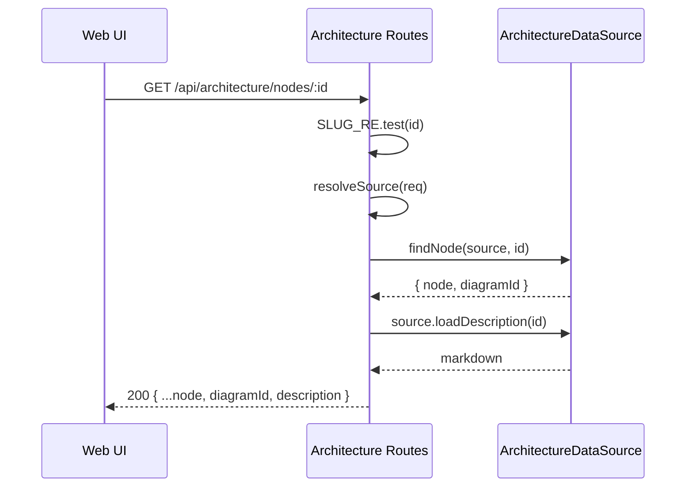

The REST surface defined in [packages/server/src/routes/architecture.ts](packages/server/src/routes/architecture.ts). Eight endpoints over an injected `ArchitectureDataSource`; every dynamic segment is slug-validated before any backend call. Typed `ApiArchitectureError` bodies are returned for missing diagrams, nodes, or descriptions; PUT layout responds 501 `layout_not_supported` when the consumer didn't supply a `LayoutStore`.

## Responsibilities
- Read endpoints: `GET /api/architecture`, `/manifest`, `/diagrams`, `/diagrams/:slug` (and `.../nodes`, `.../edges`), `/nodes/:id` (and `.../description`).
- Layout endpoints: `GET /diagrams/:slug/layout` returns persisted positions (or an empty layout if no store is configured); `PUT /diagrams/:slug/layout` validates the body via `normalizeLayoutUpdate` and persists via the injected `LayoutStore` — or 501s when none is wired.
- Resolve the data source **per request** via `resolveSource(req)`, enabling consumers (e.g. a GitHub-API viewer) to pick a different repo per request without restarting the server.
- Translate typed errors (`DiagramNotFoundError`, `NodeNotFoundError`, `DescriptionNotFoundError`, `LayoutInvalidError`) into the corresponding HTTP statuses regardless of which backend threw them.

## Request Flow

```mermaid
sequenceDiagram
  participant Web as Web UI
  participant Routes as Architecture Routes
  participant Source as ArchitectureDataSource
  Web->>Routes: GET /api/architecture/nodes/:id
  Routes->>Routes: SLUG_RE.test(id)
  Routes->>Routes: resolveSource(req)
  Routes->>Source: findNode(source, id)
  Source-->>Routes: { node, diagramId }
  Routes->>Source: source.loadDescription(id)
  Source-->>Routes: markdown
  Routes-->>Web: 200 { ...node, diagramId, description }
```

## Tech Stack
- Express Router
- Interfaces and errors from [[data-source-types]]
- `@tecture/shared` API types
