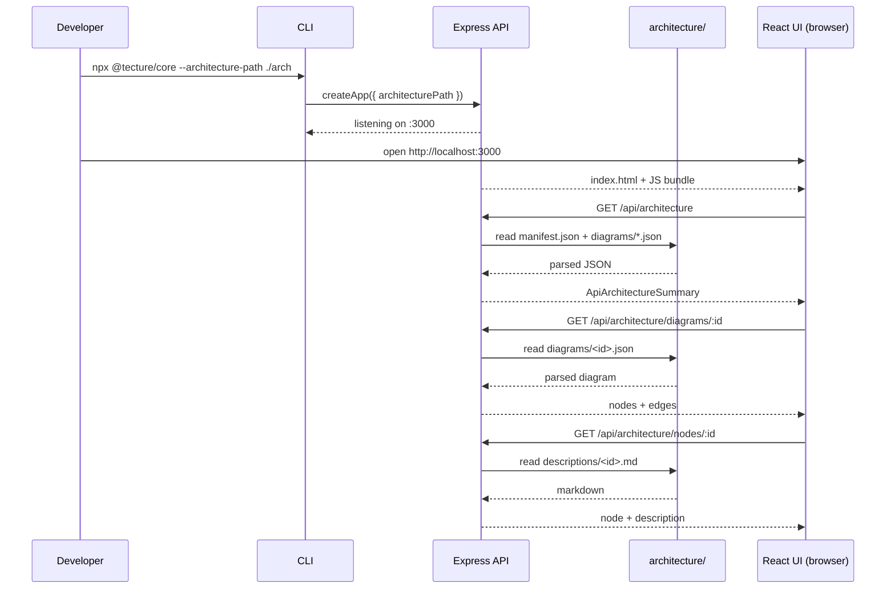

The Tecture IO system itself — a single npm package (`@tecture/core`) that renders next-generation architecture documentation generated by coding agents. It bundles a Node.js CLI, an Express REST API, and a React + Vite UI. The CLI launches an HTTP server that serves both the API and the pre-built UI on the same port, so there is nothing to configure and nothing to deploy.

## Responsibilities
- Accept a path to an `architecture/` directory (default `./architecture`).
- Expose a read-only REST API that surfaces the manifest, each diagram, and per-node descriptions.
- Serve the built React SPA that fetches those endpoints and renders interactive, drill-downable architecture diagrams.

## Tech Stack
- `nodedotjs` ≥ 20 runtime
- `express` 4 for HTTP
- `react` 18 + `vite` for the UI, bundled into the server at build time via `tsup`
- Published as a single ESM executable with a `#!/usr/bin/env node` shebang

## Runtime Flow

